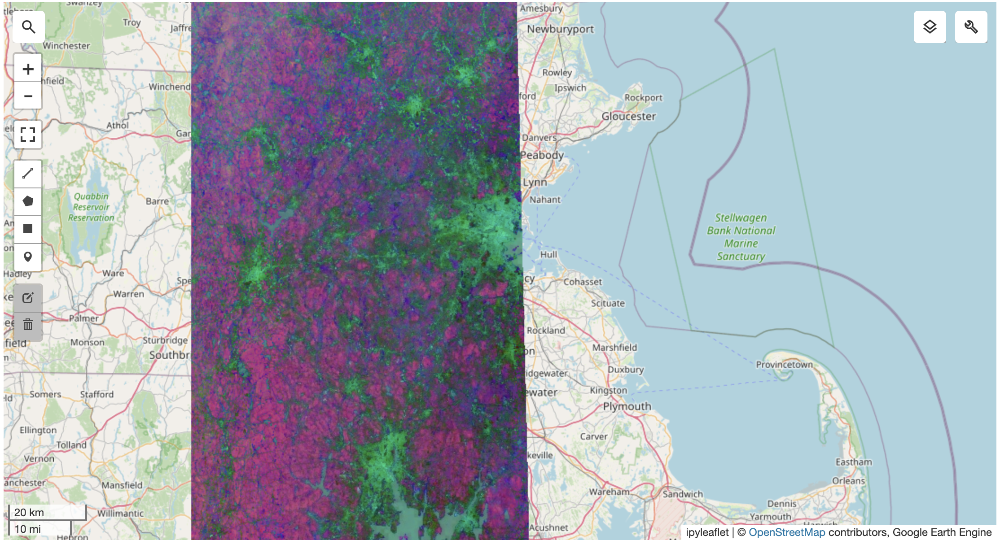

# Wealth Mapping with Alpha Earth Embeddings

This repository contains code for pulling and visualizing experimenting with Alpha Earth embeddings. We then use these embeddings to predict wealth and poverty across various countries in the SustainBench dataset, matched spatially and temporally.

## Setup
1. Clone the repo 
2. Setup your conda environment with environment.yml (change the prefix for your environment name):
   ```bash
   conda env create -f environment.yml
   conda activate gee
   ```
3. Create your own Earth Engine account and follow the instructions [here](https://developers.google.com/earth-engine/guides/python_install) to authenticate your account.
4. Run all the cells. You should get a visualization that looks like this:

   
